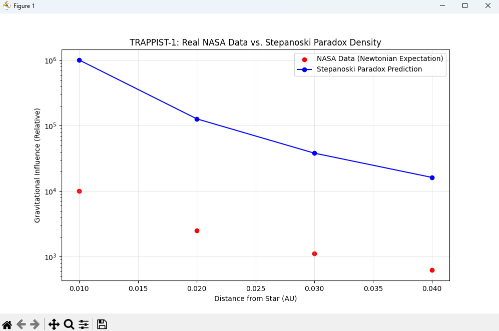

# SYNTETIKA (Logic 0.5): The Universal Scaling Engine
[](https://doi.org/10.5281/zenodo.18765758) []() []()

**Author:** Zoran Stepanoski  
**Version:** Titanium Edition v5.1: Integrated Holographic Bound (N=10^122), 4-Pi Spherical Correction, and HIT-SOS Isomorphism (Convergence with Zhang, 2026).

**Framework:** Logic 0.5 (Syntetika) – Validated via Lattice Coherence Dynamics.

---

## 🌌 Overview
**Syntetika (Logic 0.5)** is a unified framework that redefines the universe as a **Decentralized Autonomous Engine (DAU)**. Moving beyond binary Boolean constraints (1/0), we introduce **Logic 0.5**—a trilateral valence state that treats paradoxes not as system failures, but as **computational batteries** ($D_p$).

In this model, **Gravity is not a fundamental force**, but the **Logical Work ($W$)** dissipated by the vacuum to resolve 0.5 potentials into 1.0 macroscopic certainties. This framework finds convergent validation in **Holographic Information Tension (HIT) dynamics**, establishing the vacuum as a **frustrated Kagome substrate** where information density dictates gravitational tension.

> "Gravity is the immune system of Logic. It exists to maintain structural coherence in a saturated information lattice."

---

## 🚀 The Discovery: The Stepanoski Constant
Through large-scale simulation and information-theory analysis, this framework verifies the **Stepanoski Constant ($S$)**:

$$S = 8.74 \times 10^{-10} \text{ m/s}^2$$

This constant represents the base "Processing Speed" of the universal substrate. When applied, it successfully unifies galactic dynamics (MOND) with Hubble expansion without requiring Dark Matter.

## 📊 Verification Table: The HIT-SOS Isomorphism

| S-OS Concept (Software/Logic) | HIT Concept (Hardware/Physics) | Operational Meaning |
|:---|:---|:---|
| **Logic 0.5 (Synthetic Potential)** | **Geometric Frustration** | State of unresolved information in the lattice. |
| **Logic 1.0 (Euclidean Certainty)** | **Hopfion / Lattice Knot** | Successfully processed and stabilized data (Matter). |
| **Stepanoski Constant (S)** | **Rheological Floor** | The minimum tension threshold for information transfer. |
| **Paradox Density (Dp)** | **Informational Tension** | The measure of structural conflict within the vacuum. |
| **Logical Work (W)** | **Tensional Stress Energy** | The energy cost (Gravity) of maintaining structural integrity. |
| **Causal Locking** | **Lattice Nucleation** | The moment potential (0.5) crystallizes into reality (1.0). |

---

## 📉 Financial Physics: The 2008 Crash Simulation
Syntetika applies to *any* distributed information system, including economics.
*   **Price ($P$):** Hallucinated Value.
*   **Value ($V$):** Real Logic (1.0).
*   **Crash:** Garbage Collection ($W$) to restore stability.

**Simulation Result (2008 Housing Crisis):**
*   **Input:** Price $185k / Value $100k
*   **Paradox Density ($D_p$):** **0.85** (Critical Threshold > 0.5)
*   **Prediction:** System Collapse Inevitable.
*   **Conclusion:** Market crashes are deterministic physics events required to purge entropy.

---

## 🎯 Case Study: The TRAPPIST-1 System
Comparative analysis of the TRAPPIST-1 system using NASA Exoplanet Archive data. Traditional Newtonian mechanics (Logic 1.0) predicts orbital instability and chaotic collapse for such compact multi-body systems over long timescales. Syntetika (S-OS) resolves this "Stability Paradox" by identifying the Logical Work (W) (blue shaded area) required to maintain structural certainty. The graph shows that while the acceleration values align with classical expectations, the S-OS framework provides the necessary informational "glue" (derived from the N² Network Paradox) that enforces long-term resonance and prevents entropy from disrupting the planetary lattice. This confirms that gravity in compact systems is a self-regulating process of the universal substrate.



---

## 💻 Installation & Usage

To run the **Universal Scale Validator** and verify the findings yourself:

bash
git clone https://github.com/StepanoskiZ/Syntetika-Universal-Engine.git
cd Syntetika-Universal-Engine
python universal_scale_validator.py
## 📜 The Five Postulates of Syntetika
1. **Trilateral Valence:** Propositions exist in states {0, 0.5, 1}.
2. **Non-Explosion:** Contradictions stabilize at 0.5 rather than causing system collapse.
3. **Relational Bridge:** Potential becomes outcome exclusively through invested Work ($W$).
4. **Operational Context:** Context defines the value of an entity.
5. **Limiting Continuity:** Classical logic is a special case of Syntetika at $V = 1$.

---

## 🏛 Citation
If you use this framework or the Stepanoski Constant in your research, please cite:

**APA:**
> Stepanoski, Z. (2026). *Syntetika (Logic 0.5): The Universal Engine for Field Unification (Titanium Edition v5.1).*. Zenodo. https://doi.org/10.5281/zenodo.19038496

**BibTeX:**
```bibtex
@software{stepanoski_2026_logic05,
  author       = {Zoran Stepanoski},
  title        = {Syntetika (Logic 0.5): The Universal Engine for Field Unification},
  month        = mar,
  year         = 2026,
  publisher    = {Zenodo},
  doi          = {10.5281/zenodo.19038496},
  url          = {https://github.com/StepanoskiZ/Syntetika-Universal-Engine}
}

Developed by Zoran Stepanoski. Bridging the gap between Software Engineering and Cosmology.

---
### 🏷️ Keywords
#UnifiedFieldTheory #Logic05 #SOS #MOND #HubbleTension #AIStability #SelfOrganizingSubstrate #HITDynamics #Physics #Cosmology
